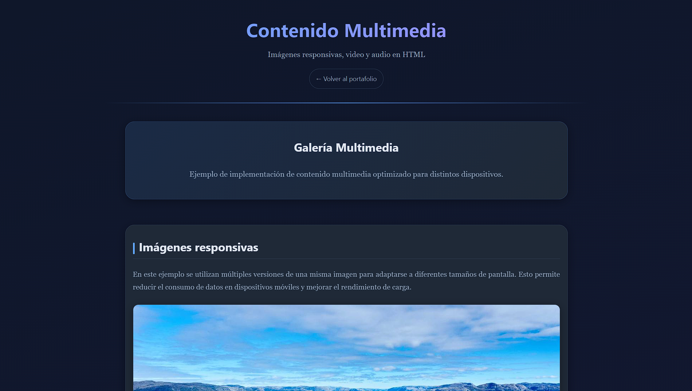

# Formulario con Validaciones HTML

Formulario de registro completo construido con **HTML5** y **CSS3**, que demuestra el uso de distintos tipos de `input`, validaciones nativas del navegador y buenas prácticas de accesibilidad, sin necesidad de JavaScript ni frameworks.

🔗 **Demo en vivo:** [alexander404-hz.github.io/Formulario-Validaciones](https://alexander404-hz.github.io/Formulario-Validaciones/)

[](https://alexander404-hz.github.io/Formulario-Validaciones/)

## ✨ Características

- **Validaciones nativas HTML5** mediante atributos como `required`, `pattern`, `minlength`, `maxlength`, `min`, `max` y `title`.
- **Amplia variedad de campos de entrada**: texto, email, teléfono, contraseña, fecha, hora, `datetime-local`, semana, mes, rango, color, número, URL, archivo, búsqueda y área de texto.
- **Datalists** para sugerencias de autocompletado en varios campos (dominios de correo, navegadores, horarios, montos, colores, etc.).
- **Etiquetas flotantes (floating labels)** para una experiencia de usuario más moderna.
- **Accesibilidad**: uso de `fieldset`/`legend`, `label` asociados a cada input, `aria-label` en la navegación y atributos `autocomplete`.
- **Metadatos SEO y redes sociales**: Open Graph y Twitter Cards configurados para una correcta previsualización al compartir el enlace.
- **Favicon e íconos** adaptados para distintos dispositivos, junto con `site.webmanifest`.
- Diseño totalmente responsivo mediante CSS personalizado.

## 📁 Estructura del proyecto

```
Formulario-Validaciones/
├── assets/
│   ├── css/
│   │   └── styles.css        # Estilos del formulario
│   ├── icons/                # Favicons e íconos (svg, png, apple-touch-icon)
│   └── img/
│       └── preview.png       # Imagen usada en Open Graph / Twitter Card
├── favicon.ico                # Favicon principal
├── index.html                 # Página principal con el formulario
└── site.webmanifest           # Manifiesto web (PWA / íconos)
```

## 🧩 Campos incluidos en el formulario

| Sección | Campos |
|---|---|
| **Datos personales** | Nombre completo, correo electrónico, teléfono, fecha de nacimiento |
| **Datos de cuenta** | Contraseña (con requisitos de seguridad), confirmar contraseña |
| **Género** | Selección mediante radio buttons |
| **Intereses** | Selección múltiple mediante checkboxes |
| **Información adicional** | País, nivel de inglés (range), hora de dormir, navegador favorito, búsqueda de etiquetas, color favorito, día/fecha/semana/mes favoritos, salario mensual, sitio web, subida de currículum (PDF/DOC/DOCX), subida de foto (PNG/JPG/JPEG), biografía |

## 🚀 Uso

Este proyecto no requiere instalación ni dependencias. Solo necesitas un navegador web.

1. Clona el repositorio:
   ```bash
   git clone https://github.com/alexander404-hz/Formulario-Validaciones.git
   ```
2. Entra a la carpeta del proyecto:
   ```bash
   cd Formulario-Validaciones
   ```
3. Abre `index.html` directamente en tu navegador, o sirve el proyecto con un servidor local (por ejemplo, la extensión *Live Server* de VS Code).

## 🛠️ Tecnologías utilizadas

- HTML5
- CSS3

## 👤 Autor

**Alexander Hernández**
Portafolio: [alexander404-hz.github.io/Portafolio](https://alexander404-hz.github.io/Portafolio/)

## 📄 Licencia

© 2026 Alexander Hernández. Todos los derechos reservados.